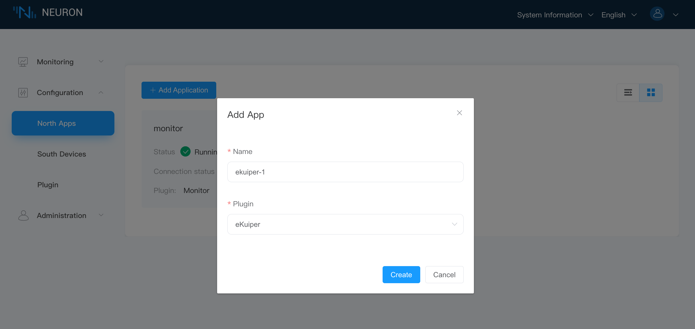
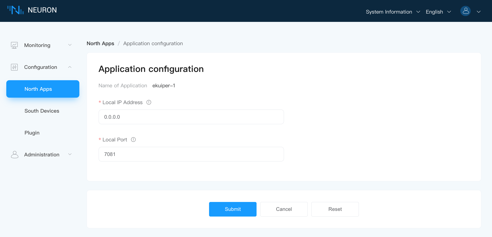
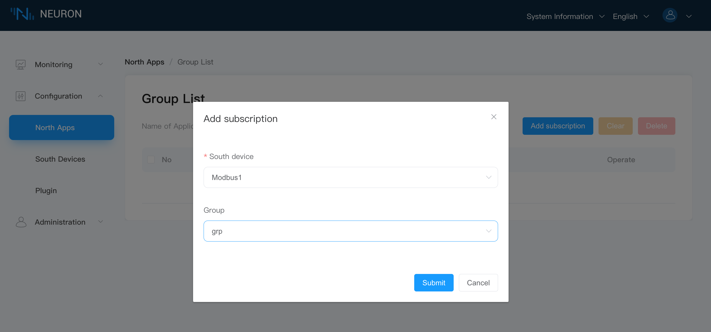
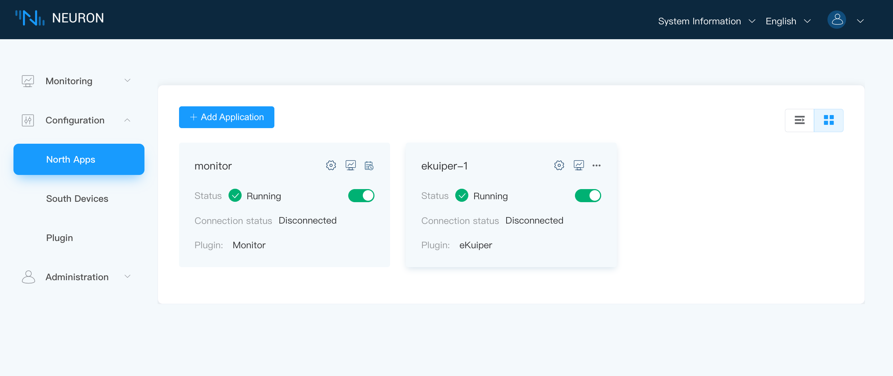
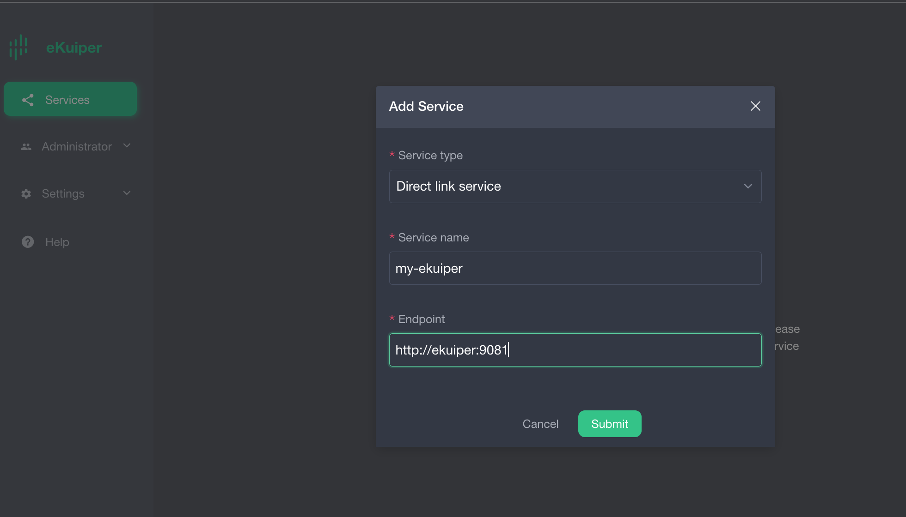
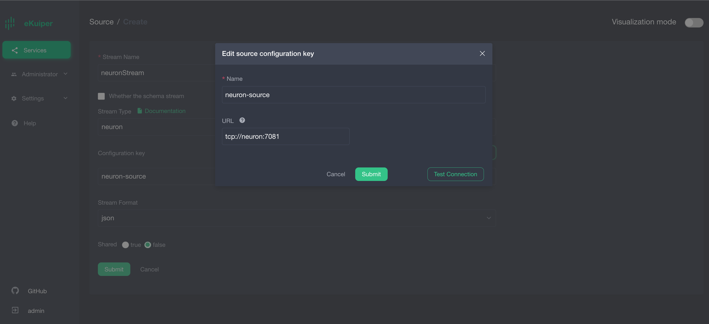
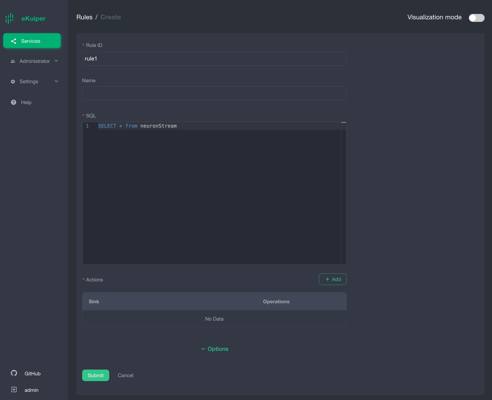
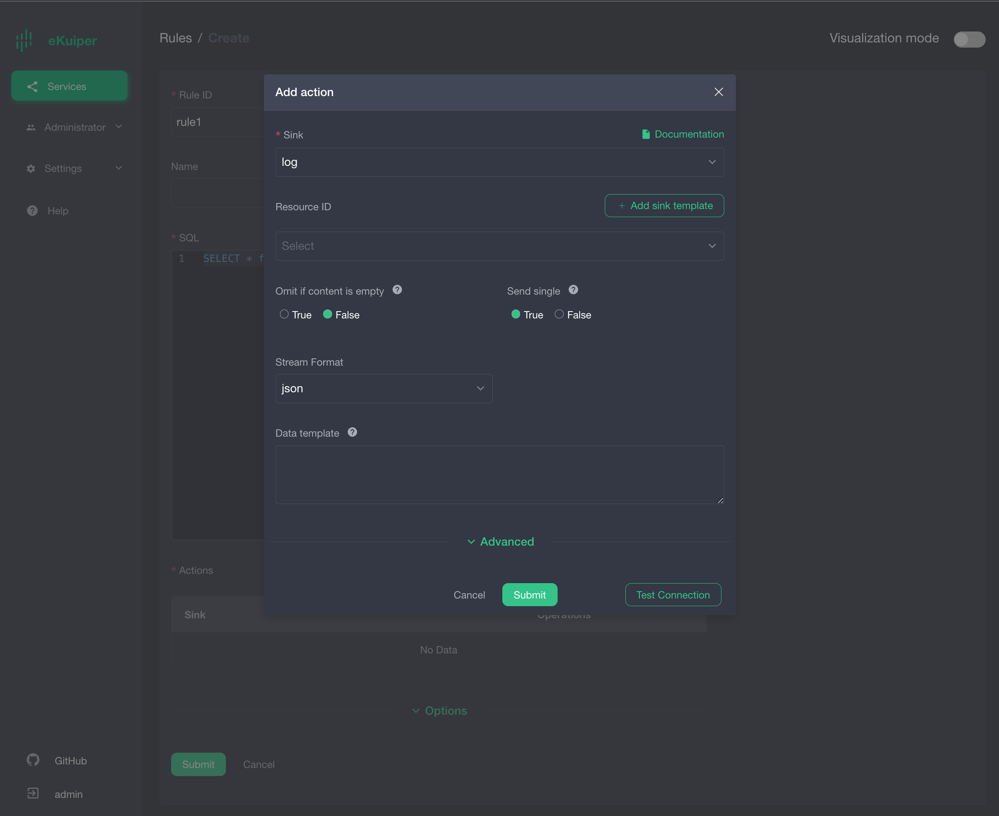
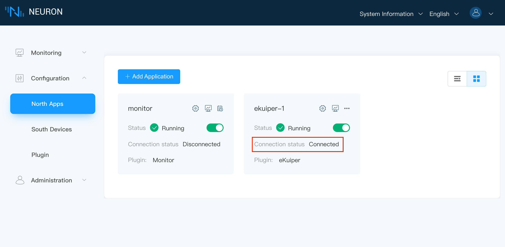
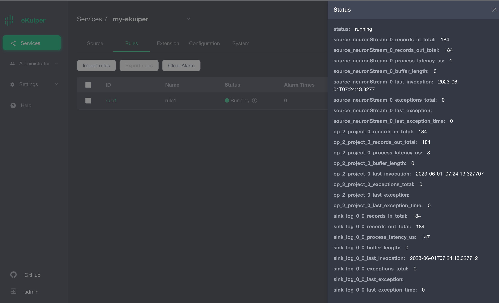

# Neuron and eKuiper Integration Best Practices

This article provides a detailed introduction to deploying Neuron 2.4 and eKuiper 1.9 with TCP connection using Docker Compose. Here is the specific configuration process:

## Quick Deployment

Both Neuron and eKuiper support binary installation packages and Docker container deployment solutions. This article takes the Docker solution as an example and uses the [Docker Compose](https://docs.docker.com/compose/) approach to achieve one-click deployment of the two components on the edge.

1. Copy the `docker-compose.yml` file to the deployment machine. Its content includes Neuron, eKuiper, and eKuiper's management interface eKuiper Manager.

   ```yaml
   version: '3.4'
   
   services:
      manager:
         image: emqx/ekuiper-manager:1.9
         container_name: ekuiper-manager
         ports:
            - "9082:9082"
      ekuiper:
         image: lfedge/ekuiper:1.9
         ports:
            - "9081:9081"
         container_name: ekuiper
         hostname: ekuiper
         environment:
            KUIPER__BASIC__CONSOLELOG: "true"
            KUIPER__BASIC__IGNORECASE: "false"
         volumes:
            - /tmp/data:/kuiper/data
            - /tmp/log:/kuiper/log
   
      neuron:
         image: emqx/neuron:2.4.0
         ports:
            - "7000:7000"
            # The default port to communicate with eKuiper. Change it if you want to use another port.
            - "7081:7081"
         container_name: neuron
         hostname: neuron
         environment:
            DISABLE_AUTH: 1
         volumes:
            - /tmp/neuron/data:/opt/neuron/persistence
   
   ```
   Here is the configuration explanation:

   * In this configuration file, Neuron and eKuiper use port 7081 for communication. Neuron listens on port 7081 and waits for eKuiper's connection.

   * Since the Neuron container and eKuiper container have configured hostnames, the software can access each other using the hostnames. If hostnames are not configured, you can use the IP address of the host machine for communication.

   * The version of the Neuron, eKuiper, and eKuiper-manager images can be adjusted according to the actual usage. As long as Neuron >= 2.4.0 and eKuiper >= 1.9.0, it should work. It is recommended to keep the eKuiper-manager version consistent with the eKuiper version.

   * For eKuiper environment variable configurations, you can refer to [specific documentation for eKuiper](https://ekuiper.org/docs/zh/latest/configuration/configuration.html).

2. In the directory of `docker-compose.yml`, run following:
   
   ```shell
   # docker compose up -d
   ```

3. After all the containers have started, please use the `docker ps` command to confirm that all the containers have started successfully.

   

## Configure Neuron 

### Southbound Device

Once Neuron is launched, the initial step involves configuring the southbound devices and employing a simulator for data collection simulation. For comprehensive guidance on setting up the southbound devices and the simulator, please refer to the [Neuron Quick Start Guide](../../../quick-start/quick-start.md) to successfully complete this crucial configuration phase.

### Northbound Application

**Create the Application**

On **Configuration -> North Apps**, click **Add Application** to add an eKuiper client node.

1. Enter an application name, for example, "ekuiper-1".
2. In the dropdown menu, you will see the available northbound applications for this software version. In this case, select the plugin for eKuiper.



Upon successful application creation, a new card for the application will appear on the Northbound Application Management interface, showing an **Initializing** work state and a **Disconnected** connection status.


**Configure the Application**

Click the **Application Configuration** icon on the application card to enter the application configuration interface, click **Confirm** to use the default configuration.




**Subscribe to a Group**

Click on any blank area of the application card "ekuiper-1" to enter the subscription group interface.



1. Click the **Add Subscription** button in the top right corner.
2. In the dropdown menu, select the southbound device. In this case, we choose the previously created southbound device "Modbus1".
3. Select the desired Group to subscribe to from the dropdown menu. In this case, we choose the group of the previously created southbound device "Modbus1".
4. Click **Submit** to complete the subscription.

At this point, Neuron is configured for data collection and sending the collected data to the northbound eKuiper channel.

Note: Since there is currently no eKuiper connected to the current Neuron, the connection status of the Neuron northbound application to the eKuiper node will remain **Disconnected**.



## Configure eKuiper

eKuiper Manager is a web management interface that allows you to manage multiple eKuiper instances. Therefore, we need to configure the eKuiper instances managed by the manager. For detailed instructions, please refer to the documentation on how to use the [eKuiper Management Console](https://ekuiper.org/docs/en/latest/operation/manager-ui/overview.html).

In the following tutorial, we will use eKuiper Manager to configure and manage eKuiper, including the creation of flows and rules.

### Add eKuiper Node

To log in to eKuiper Manager, access http://[yourhost]:9082 using your web browser. The default username and password are: 

- admin
- public

To add an eKuiper service:



1. Select the **Service Type** as **Direct Link Service**.

2. Choose a custom service name.

3. In the **Endpoint** URL field, enter the hostname of the eKuiper container followed by the port number 9081.

### Create Neuron Data Stream

Log in to your eKuiper node and navigate to the **Stream Management** page to create a new stream. Here are the specific configurations:



1. You can customize any stream name. In the example, let's name it `neuronStream`.

2. Set the stream type as `neuron`, indicating that this stream will connect to Neuron.

3. Configure the group by selecting "Add Configuration Group." Name it `neuron-source` and set the path as `tcp://neuron:7081`, where `neuron` matches the hostname of the Neuron container.

4. Click on "Submit" to save the configuration.

### Create eKuiper Rules

After establishing the Neuron flow, we can create multiple rules in eKuiper to perform various calculations and processing on the collected data. This article only show a simple rule that print Neuron data to eKuiper's log. For more advanced data processing capabilities of eKuiper, please refer to the additional resources section.

Here is an example of creating a new eKuiper rule:



Add a rule action and submit the rule.



## Verify Neuron and eKuiper Communication Status

Neuron connection is normal



eKuiper Rule running status is normal



eKuiper log message is normal.


