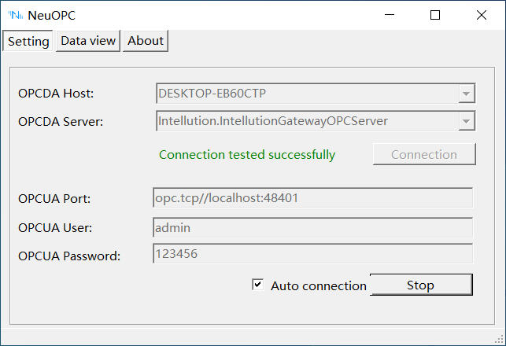
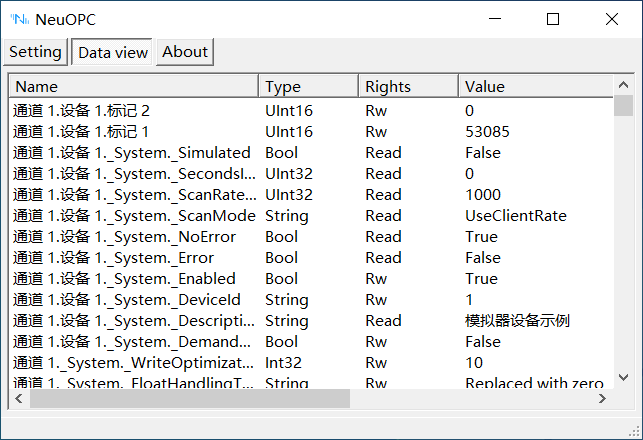

# Connect to NeuOPC

## NeuOPC setting

1. Fill in the OPCDA Host, either IP or Hostname, or default to local if not filled in.

2. Try clicking on the drop-down button for OPCDA Server to try to get a list of DA Servers on the target Host, if the drop-down is empty it means that no DA Server on any target host is detected.

3. Click the Connect button, the server will display all the available measurement point information of the current DA Server after successful connection, and the status bar will show the current server connection information.

4. Set the OPCUA Port.

5. Set the OPCUA User.

6. Set the OPCUA Password.

7. Click the Run button, and after the UA Server starts, all the measurement points in the list will be mapped to the NeuOPC directory of the UA Server, and the UA namespace of all measurement points will be 2.

8. By double-clicking on the Name column of the neuopc site list, the corresponding site name can be copied to the clipboard and then pasted in the tag form of neuron.
    

  

## Neuron OPC UA setting

1. Add an opcua device to the neuron southbound device manager.

2. Change the endpoint url to the UA Server address of neuopc in the device configuration.

3. Fill in the Username in the device configuration, as set in neuopc.

4. Fill in the Password in the device configuration, the same as set in neuopc.

5. Submit the setup form directly without filling in the Cert and Key.

### Test Data

|  Name                   |  Address                     | Attribute |  Date type  |
| ----------------------- | ------------------------- | ---- | ------ |
| _System._ProductVersion | 2!_System._ProductVersion | Read | STRING |
| _System._ProductName    | 2!_System._ProductName    | Read | STRING |
| _System._DateTimeLocal  | 2!_System._DateTimeLocal  | Read | UINT32 |

