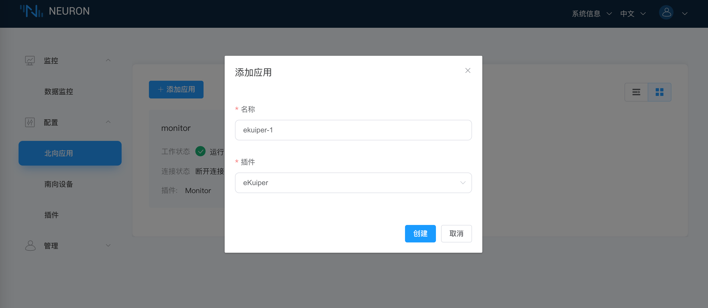
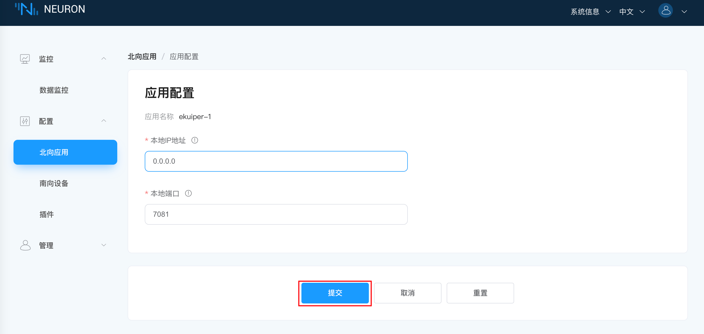
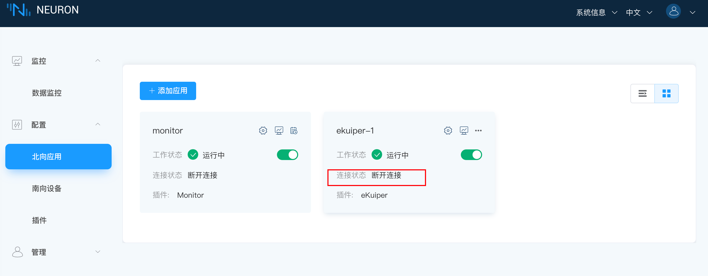
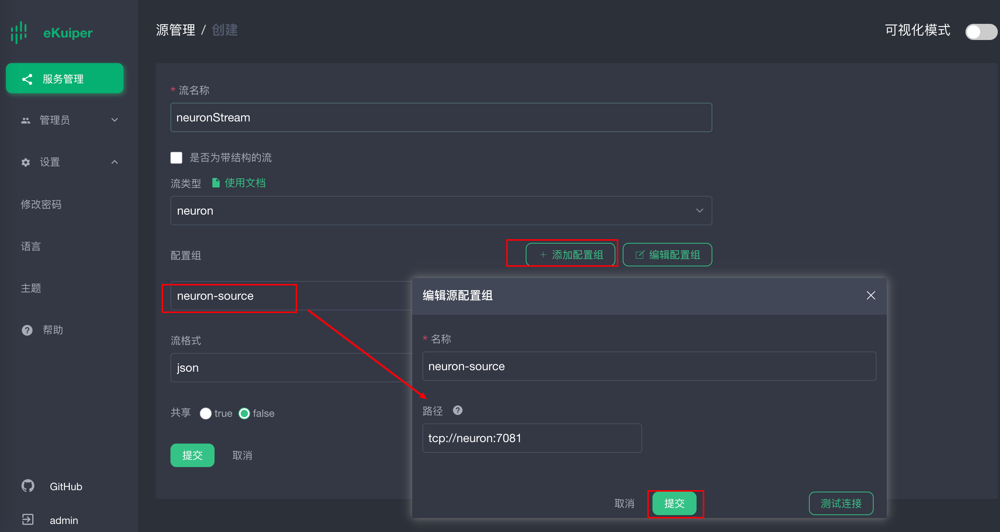
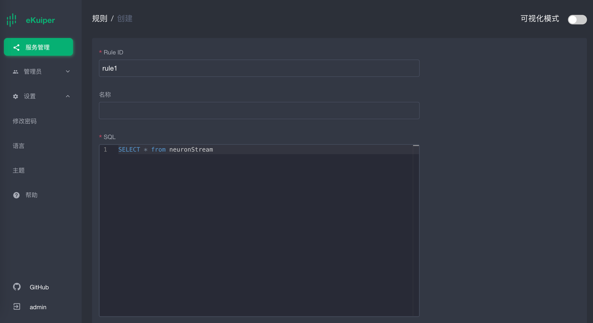
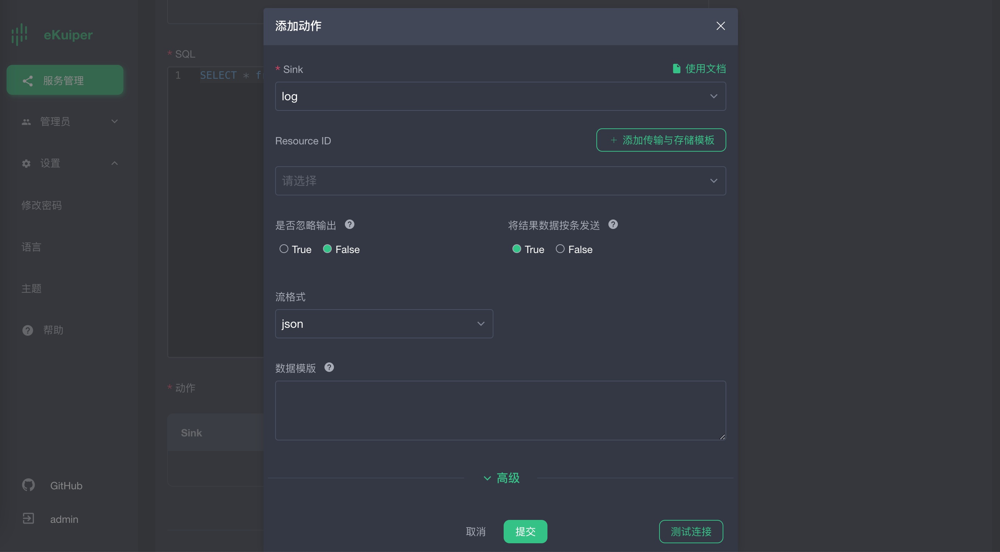
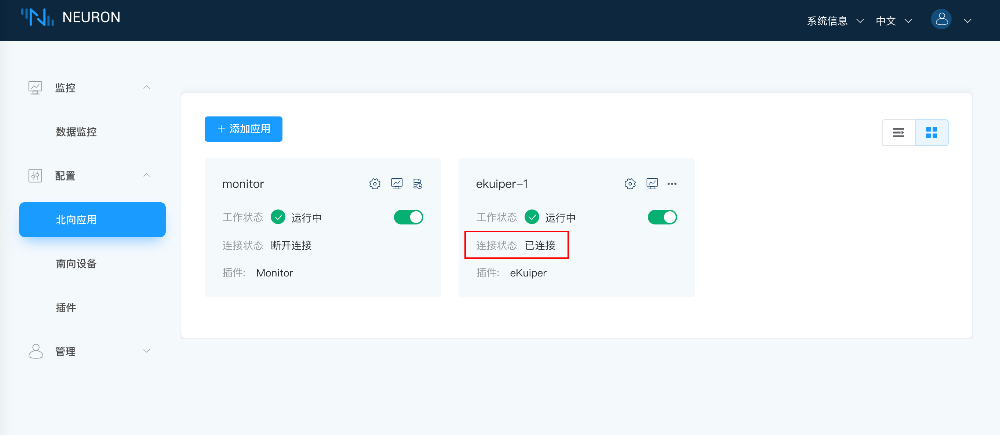
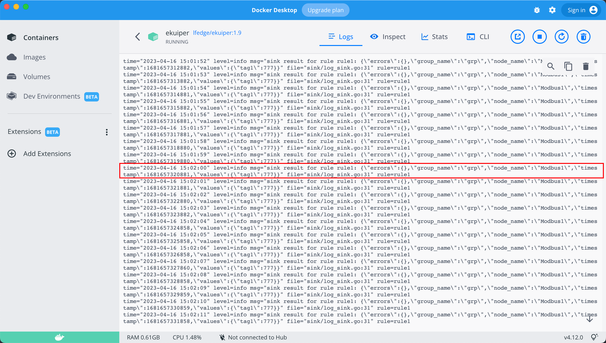

# Neuron 与 eKuiper 集成最佳实践

本篇文章详细介绍通过 Docker Compose 的部署方式，实现 Neuron2.4 和 eKuiper1.9 的 TCP 连接，并将 Neuron 收集到的数据打印到 eKuiper 的日志中，以下为具体的配置过程。

## 快速部署

Neuron 和 eKuiper 都支持二进制安装包以及 Docker 容器化部署方案。本文以 Docker 方案为例，采用 [docker compose](https://docs.docker.com/compose/) 方式，一键完成边缘端两个组件的快速部署。

1. 复制 **docker-compose.yml**文件到部署的机器上。其内容如下，包含了 Neuron，eKuiper 以及 eKuiper 的管理界面 eKuiper manager。

   ```yaml
   version: '3.4'
   
   services:
      manager:
         image: emqx/ekuiper-manager:1.9
         container_name: ekuiper-manager
         ports:
            - "9082:9082"
      ekuiper:
         image: lfedge/ekuiper:1.9
         ports:
            - "9081:9081"
         container_name: ekuiper
         hostname: ekuiper
         environment:
            KUIPER__BASIC__CONSOLELOG: "true"
            KUIPER__BASIC__IGNORECASE: "false"
         volumes:
            - /tmp/data:/kuiper/data
            - /tmp/log:/kuiper/log
   
      neuron:
         image: emqx/neuron:2.4.0
         ports:
            - "7000:7000"
            # The default port to communicate with eKuiper. Change it if you want to use another port.
            - "7081:7081"
         container_name: neuron
         hostname: neuron
         environment:
            DISABLE_AUTH: 1
         volumes:
            - /tmp/neuron/data:/opt/neuron/persistence
   
   ```
   以下为配置说明：
   
   - 在本配置文件中，Neuron 与 eKuiper 的通讯端口使用 7081，Neuron 监听 7081 端口，等待 eKuiper 的链接。

   - 由于 Neuron 容器和 eKuiper 容器配置了 hostname，所以软件之间可以通过 hostname 相互访问，如果没有配置 hostname，可以通过宿主机的 IP 相互访问。
   
   - Neuron、eKuiper 和 eKuiper-manager 的镜像版本，可根据实际使用情况自行调整，只要Neuron >= 2.4.0，eKuiper >= 1.9.0即可，eKuiper-manager 版本与 eKuiper 版本最好保持一致。<!--ekuiper manager 下线这个，目前 ekuiper 是冷处理，等 ECP Edge 上线之后更新，Neuron 这里的口径也要统一下 @QQDQ -->
   
   - eKuiper 环境变量配置，可参考 [eKuiper - 配置](https://ekuiper.org/docs/zh/latest/configuration/configuration.html)
   
2. 在该文件所在目录，运行：
   
   ```shell
   # docker compose up -d
   ```

3. 所有的容器启动完毕之后，请使用 **docker ps** 命令确定所有的容器已经正常启动。

   

## 配置 Neuron

### 添加南向设备

Neuron 启动之后，我们需要配置 Neuron 的南向设备和北向 eKuiper 应用通道，然后启动模拟器进行模拟数据采集。

南向设备和模拟器配置，请参考 [Neuron 快速教程](../../../quick-start/quick-start.md) ，完成南向配置部分。

### 添加北向应用

在配置菜单中选择**北向应用管理**，进入到北向应用管理界面，此时未添加任何应用，需要手动添加应用，在本例中，我们将创建一个 eKuiper 应用。

#### 添加应用

1. 点击**添加设备**按键；
2. 填写应用名称，例如，ekuiper-1；
3. 在弹出的对话框中，输入名称，并选择 ekuiper 的插件，如下图所示。

4. 创建应用成功之后，会在北向应用管理界面出现一个刚刚创建的应用的卡片，此时应用的工作状态在初始化，连接状态在断开连接状态中。

#### 应用配置

点击查看第一步应用卡片 ekuiper-1 上的应用配置，点击确认，使用默认配置即可。



#### 订阅南向数据

点击第一步应用卡片 ekuiper-1 中任意空白处，进入到订阅Group界面，如下图所示。


1. 点击右上角的**添加订阅**按键添加订阅；
2. 下拉框选择南向设备，这里我们选择之前建好的南向设备 Modbus1 ；
3. 下拉框选择所要订阅的 Group，这里我们选择之前建好的南向设备 Modbus1 的group；
4. 点击**提交**，完成订阅。

至此，Neuron 已配置好数据采集，并将采集到的数据发送到北向的 eKuiper 通道中。

注意：由于目前没有 eKuiper 连接到当前 Neuron，所以 Neuron 北向应用 eKuiper 节点的连接状态仍为**断开状态**



## 配置 eKuiper

[eKuiper Manager](https://ekuiper.org/docs/zh/latest/operation/manager-ui/overview.html#%E6%A6%82%E8%A7%88) 是一个 Web 管理界面，可管理多个 eKuiper 实例。因此，我们需要设置 eKuiper Manager 管理的 eKuiper 实例。详细设置请参考eKuiper 管理控制台的使用。

以下教程中，我们使用 eKuiper Manager对 eKuiper 进行配置管理，包括流和规则的创建。

### 添加 eKuiper 节点

通过 http://[yourhost]:9082 登录 ekuiper Manager，用户名密码为：admin/public

添加 eKuiper 服务：


1. 服务类型选择**直接连接服务**

2. 服务名称可自定义

3. 端点URL，输入 eKuiper 容器的 hostname 加端口号 9081

### 创建 Neuron 流

登录 my-eKuiper 节点，在**流管理**页面创建流。具体配置如下：



1. 可自定义任意流名称，上图取名为 neuronStream

2. 流类型设置为 **neuron**，表示该流会连接到 Neuron 中。

3. 配置组，选择添加配置组，名称为 neuron-source，路径为 tcp://neuron:7081。其中 Neuron 与 Neuron 容器的 hostname 一致。

4. 点击**提交**。

### 配置 eKuiper 规则

Neuron 流建立之后，我们可以在 eKuiper 里创建任意多条规则，对采集的数据进行各种计算和处理。本文仅介绍Neuron 与 eKuiper 的 TCP 通讯建立和数据打通，所以仅配置一个最简单的规则，将 Neuron 的数据打印到eKuiper 的 log 中。

新建 eKuiper 规则如下：

添加规则动作，并提交规则。



## 查看 Neuron 与 eKuiper 连通状态

Neuron 连接状态正常



eKuiper 规则运行状态正常


eKuiper 日志信息正常




